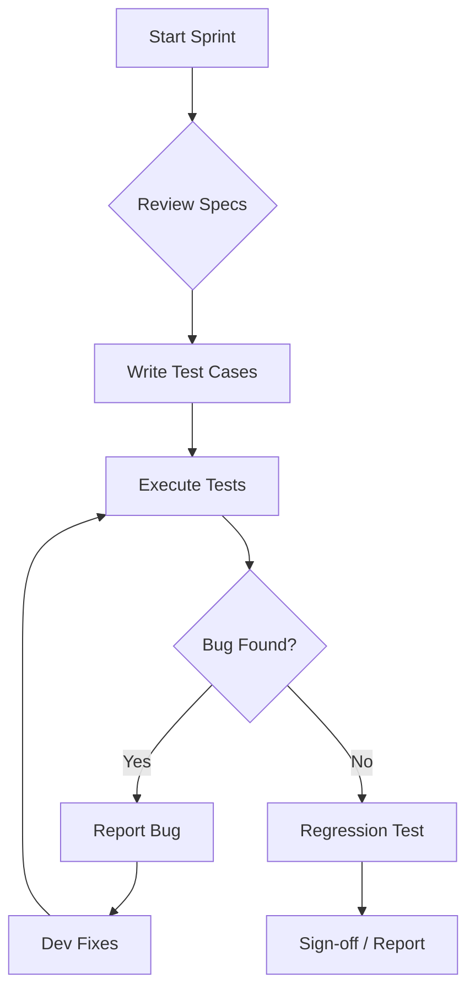

# 🧪 Manual Testing Pro Max: Practical Guide & Templates

Tài liệu này không chỉ là lý thuyết, mà là bộ công cụ thực chiến để sử dụng hàng ngày trong công việc kiểm thử thủ công.

## 1. 📝 Test Case Template (Chuẩn Industry)
Dùng template này để viết test case nhanh và chuyên nghiệp.

| ID | Title | Pre-conditions | Steps | Expected Result | Priority | Type |
| :--- | :--- | :--- | :--- | :--- | :--- | :--- |
| TC_01 | Verify Login with valid info | User is on Login page | 1. Input Email<br>2. Input Pass<br>3. Click Login | Redirect to Dashboard | High | Functional |
| TC_02 | Verify Password Masking | User is on Login page | 1. Input any text into Pass field | Text is hidden (dots/stars) | Medium | Security |

---

## 2. 🐞 Bug Report Template
Một bug report tốt giúp Dev sửa nhanh hơn 50%.

```markdown
### [BUG] - {Tiêu đề ngắn gọn, súc tích}
**Environment:** Staging / Production / iOS 17.2 / Chrome 120
**Severity:** Critical / High / Medium / Low
**Priority:** P0 / P1 / P2 / P3

**Steps to Reproduce:**
1. Go to URL '...'
2. Click on '...'
3. Input '...'
4. Observed '...'

**Expected Result:**
- {Kết quả mong đợi đúng theo spec}

**Actual Result:**
- {Kết quả sai hiện tại}

**Attachments:**
- [Link to Screenshot/Video]
- [Log file/Console output]
```

---

## 3. ⚡ Cheatsheet: Test Design Techniques
Áp dụng nhanh khi brainstorm test case:
- **Boundary Value Analysis (BVA):** Luôn test `Min-1`, `Min`, `Min+1`, `Max-1`, `Max`, `Max+1`.
- **Equivalence Partitioning (EP):** Chỉ cần test 1 giá trị đại diện cho mỗi nhóm (vd: tuổi 1-18, 19-60, 61+).
- **State Transition:** Vẽ sơ đồ trạng thái của Object (vd: Order: New -> Paid -> Shipping -> Delivered).
- **Error Guessing:** Test các ký tự đặc biệt (`!@#$%^&*`), để trống, SQL Injection basic (`' OR 1=1 --`), XSS (`<script>alert(1)</script>`).

---

## 4. 💡 Pro Tips cho Daily Tasks
- **Sử dụng Extension:**
    - `Fake Filler`: Tự động điền form nhanh.
    - `GoFullPage`: Chụp ảnh toàn bộ trang web.
    - `JSON Viewer`: Xem log API dễ dàng hơn.
- **Mindset:** Đừng chỉ tìm "Lỗi", hãy tìm "Điểm yếu" của hệ thống.
- **Exploratory Testing:** Dành 30p mỗi ngày để "phá" hệ thống theo cách không có trong kịch bản.

---

## 5. 📊 Test Execution Workflow (Mermaid)


---
> 🚀 **AI Prompt Tip:** Khi nhờ AI viết Test Case, hãy copy template ở trên và nói: *"Dựa trên spec sau, hãy viết Test Case theo template tôi cung cấp: [Dán Spec]"*
